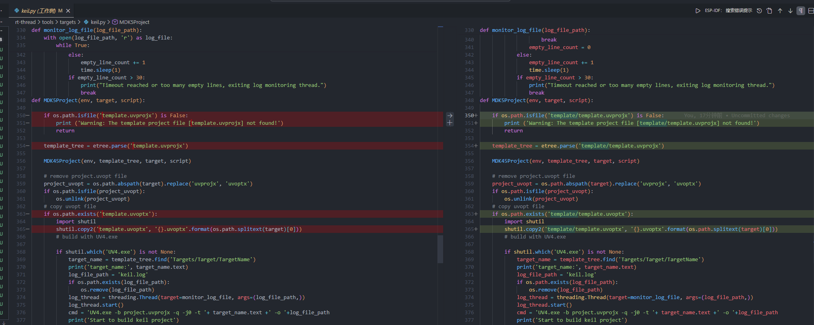
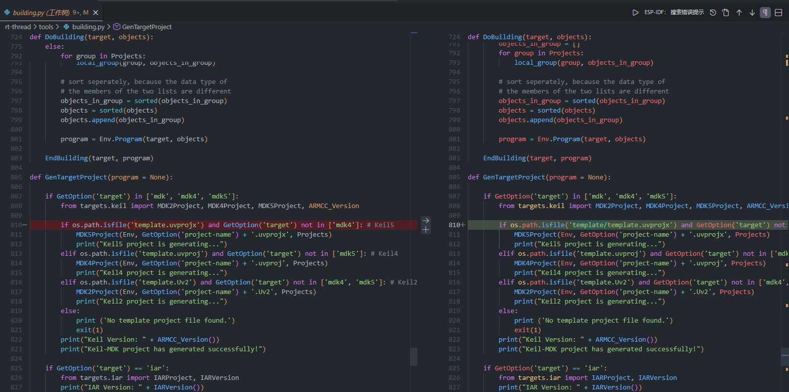
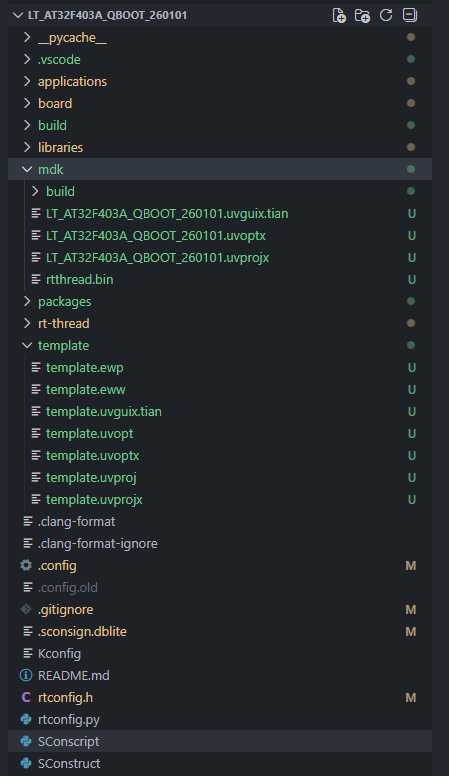

# env-v2.0.0 使用

[env github](https://github.com/RT-Thread/env-windows/releases/tag/v2.0.0)
[env 官方问题解答](https://club.rt-thread.org/ask/article/f61a47d421b10fb4.html)
[rtt官方介绍教程](https://www.rt-thread.org/document/site/#/development-tools/env/env)


## 关于env的环境配置

关于rtthread v5.2.0以上的版本,由于开启了版本瘦身的特性，将芯片相关的sdk包都放在了env packages内管理，使用v5.2.0以上版本,需要先更新env下的packages，如何使用rtthread v5.2.0以上版本，请按照如下步骤操作：


```bash
# 更新env下的packages文件夹
menuconfig # scons 使用menuconfig开启芯片相关的sdk包
scons -j8
scons --dist --target=mdk5 --project-name="LT_AT32_BBOX_260101" --project-path="D:\user\Desktop\github\rt-thread\lt_workspace\LT_AT32_BBOX_260101"
```


## 关于env的部分使用技巧

```bash
#带ui的menuconfig
scons --pyconfig

#前面将bsp内的工程导出一份到工作区
scons --dist --target=mdk5 --project-name="LT_AT32F403A_QBOOT_260101" --project-path="D:\user\Desktop\github\rt-thread\workspace\LT_AT32F403A_QBOOT_260101"

#如果你只是这样将使用如下命令，那么scons还是只会生成一个priect.xxx的keil工程
scons --target=mdk5

#为了文件目录的优雅
scons --target=mdk5 --project-name="mdk/LT_AT32F403A_QBOOT_260101"

# 然后把模板文件也藏起来
# 修改rt-thread\tools\targets\keil.py
# 修改rt-thread\tools\building.py 
# 文件内带有template的文件模板
```

- 部分修改部分





- 最后的文件目录


