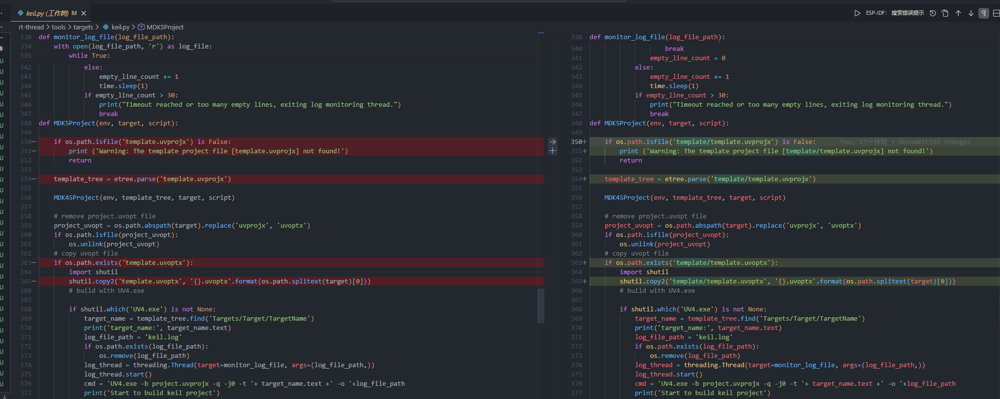
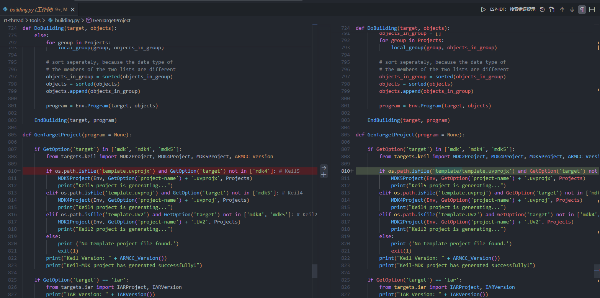
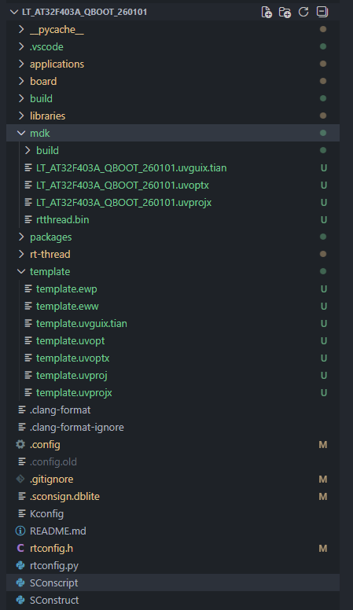

# env-v2.0.0 使用

[env github](https://github.com/RT-Thread/env-windows/releases/tag/v2.0.0)
[env 官方问题解答](https://club.rt-thread.org/ask/article/f61a47d421b10fb4.html)
[rtt官方介绍教程](https://www.rt-thread.org/document/site/#/development-tools/env/env)


## 关于env的环境配置

关于rtthread v5.2.0以上的版本,由于开启了版本瘦身的特性，将芯片相关的sdk包都放在了env packages内管理，使用v5.2.0以上版本,需要先更新env下的packages，如何使用rtthread v5.2.0以上版本，请按照如下步骤操作：


```bash
# 更新env下的packages文件夹
menuconfig # scons 使用menuconfig开启芯片相关的sdk包
scons -j8
scons --dist --target=mdk5 --project-name="app" --project-path=".\project"
```


## 关于env的部分使用技巧

```bash
#带ui的menuconfig
scons --pyconfig

#前面将bsp内的工程导出一份到工作区
scons --dist --target=mdk5 --project-name="LT_AT32F403A_QBOOT_260101" --project-path="D:\user\Desktop\github\rt-thread\workspace\LT_AT32F403A_QBOOT_260101"

#如果你只是这样将使用如下命令，那么scons还是只会生成一个priect.xxx的keil工程
scons --target=mdk5

#为了文件目录的优雅
scons --target=mdk5 --project-name="mdk/LT_AT32F403A_QBOOT_260101"

# 然后把模板文件也藏起来
# 修改rt-thread\tools\targets\keil.py
# 修改rt-thread\tools\building.py 
# 文件内带有template的文件模板
```

- 部分修改部分





- 最后的文件目录




# cmake + vscode工程搭建

- 导出一个最小的工程

```bash
scons --dist --target=cmake --project-name="App"
```

- 下载基本的at32的库

```bash
pkgs --update
```

- 生成cmake工程

```bash
//首先安装cmake工具
scons --target=cmake

cd build

cmake -G "MinGW Makefiles" ..

mingw32-make -j16

```

- 生成pyocd配置

```bash
#pip install pyocd
#pip install pyocd==0.35.0

# 先测试使用pyocd下载文件
python -m pyocd flash --erase chip --target _at32f403argt7

scons --target=vsc --cmsispack="D:/tools/pack/Keil5_AT32MCU_AddOn_V2.5.0/ArteryTek.AT32F403A_407_DFP.2.2.3.pack"

会在目录下生成
App.code-workspace
.vscode\tasks.json
.vscode\project.json
.vscode\launch.json
.vscode\c_cpp_properties.json
pyocd.yaml

```

- 安装vscode插件marus25.cortex-debug
- ctrl+shift+p --> Tasks: Run Task

| 任务                            | 作用                   |
| ------------------------------- | ---------------------- |
| `Build target files`            | 执行 `scons -j12` 编译 |
| `Download code to flash memory` | 用 pyOCD 烧写          |
| `Build and Download`            | 先编译再烧写           |

- 运行download code to flash memory
  - python -m pyocd flash --erase chip --target _at32f403avgt7 rt-thread.elf
- 需要修改task.json内的"args"中的rt-thread.elf
- 修改为本地的elf文件 ./build/rtthread.elf


- vscode调试工程
  - 按下F5
  - 跳出unable to find exe file at xxxx
  - 修改："executable": "rt-thread.elf",
  - 修改为："executable": "./build/rtthread.elf",
  - 完成


# sons + vscode工程搭建

- rtthread-sdk-5.2.2

## 工程前期准备

- 导出工程到工作区
  
```bash
scons --dist --target=vsc --project-path="D:\Desktop\workspace\code\git_project\5.project\at32f403a\lt_qboot_v1" --cmsispack="D:/tools/pack/Keil5_AT32MCU_AddOn_V2.5.0/ArteryTek.AT32F403A_407_DFP.2.2.3.pack"
```

- 添加.gitignore
```bash
rt-thread/          # 不提交rtt的sdk
build/              # 不提交编译文件
__pycache__/        # 不提交python缓存文件
```

- 删除无用文件,template.*文件
- 更新后下载at32 hal sdk的代码

```bash
pkgs --update
scons -j16
```

- 替换rtthread内文件
  - 运行 .\script\prepare.bat

- 修改launch.json
```json
{
    "version": "0.2.0",
    "configurations": [
        {
            "name": "Cortex Debug",
            "cwd": "${workspaceFolder}",
            "executable": "build/rtthread.elf",  //elf路径
            "request": "launch",
            "type": "cortex-debug",
            "runToEntryPoint": "Reset_Handler",
            "servertype": "pyocd",
            "armToolchainPath": "D:/tools/rtt_env/env-windows-v2.0.0/env-windows/tools/bin/../../tools/gnu_gcc/arm_gcc/mingw/bin",
            "toolchainPrefix": "arm-none-eabi",
            "targetId": "_at32f403avgt7"
        }
    ]
}
```

- 修改task.json
```json
{
    "version": "2.0.0",
    "tasks": [
        {
            "type": "shell",
            "label": "Build target files",
            "command": "scons",
            "args": [
                "-j12"
            ],
            "problemMatcher": [
                "$gcc"
            ],
            "group": "build"
        },
        {
            "type": "shell",
            "label": "Download code to flash memory",
            "command": "python",
            "args": [
                "-m",
                "pyocd",
                "flash",
                "--erase",
                "chip",
                "--target",
                "_at32f403avgt7",
                "build/rtthread.elf"    //elf路径
            ],
            "problemMatcher": [
                "$gcc"
            ],
            "group": "build"
        },
        {
            "type": "shell",
            "label": "Build and Download",
            "command": "python",
            "args": [
                "-m",
                "pyocd",
                "flash",
                "--erase",
                "chip",
                "--target",
                "_at32f403avgt7",
                "build/rtthread.elf"    //elf路径
            ],
            "problemMatcher": [
                "$gcc"
            ],
            "group": "build",
            "dependsOn": "Build target files"
        }
    ]
}
```

- 指定烧写地址
```json
{
    "type": "shell",
    "label": "Download code to flash memory",
    "command": "python",
    "args": [
        "-m",
        "pyocd",
        "flash",
        "--erase",
        "sector",
        "--target",
        "_at32f403avgt7",
        "--base-address",
        "0x08020000",
        "build/rtthread.elf"
    ],
    "problemMatcher": [
        "$gcc"
    ],
    "group": "build"
},
```


