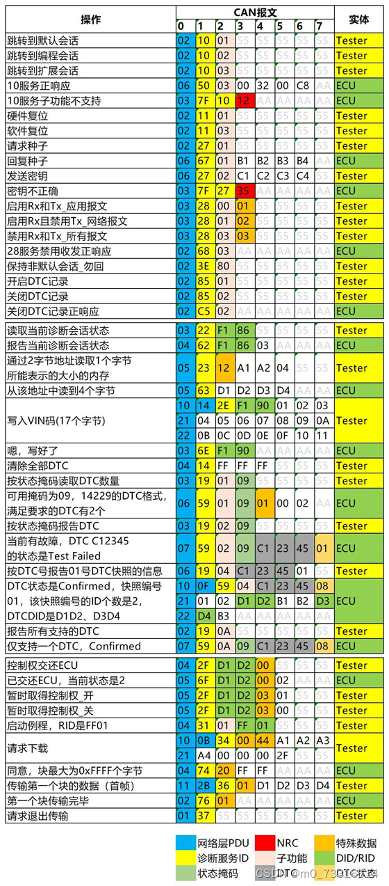

# **ISO 14229 系列标准文件简介（统一诊断服务 - UDS）**

本系列标准定义了现代汽车电子系统诊断的 **“通用语言”**。它独立于特定的网络类型（如CAN、以太网），规定了诊断通信的标准化服务、请求与响应格式，是构建高级诊断系统（如ISO 27145）的应用层基石。

## **ISO 14229-1: 规范和要求**
*   **核心定位：UDS的“核心语法与词汇总规”。**
*   **主要内容：**
    1.  **服务定义：** 系统性地定义了**所有统一的诊断服务**，包括会话控制、读写存储器、读写数据、输入输出控制、例行程序控制等。
    2.  **通信机制：** 规定了请求与响应的**通用结构、寻址方式（物理/功能寻址）、以及否定响应码**。
    3.  **协议要求：** 描述了服务的**通用行为、时序要求以及应用层接口**。
*   **阅读建议：** **理解UDS的绝对核心文件，所有开发者的必读手册。** 它规定了“说什么”和“如何说”。

## **ISO 14229-2: 会话层服务**
*   **核心定位：诊断“对话管理”规范。**
*   **主要内容：**
    1.  **会话层协议：** 定义了专门用于**管理诊断会话**的服务原语和协议数据单元。
    2.  **独立于网络：** 这部分内容主要描述会话层的逻辑功能，与下层的具体网络实现（如CAN, FlexRay, 以太网）解耦。
*   **阅读建议：** 更偏向协议栈理论设计，在实际工程中，其功能通常已整合在具体的网络实现标准中。

## **ISO 14229-3: CAN实现的统一诊断服务**
*   **核心定位：UDS在CAN总线上的“使用说明书”。**
*   **主要内容：**
    1.  **映射规则：** 详细规定了**如何将ISO 14229-1中定义的UDS服务，映射到ISO 15765-2（基于CAN的诊 断）** 的协议数据单元上。
    2.  **CAN特定参数：** 定义了在CAN网络环境下使用的**特定时间参数、寻址信息**等。
*   **阅读建议：** **使用CAN总线实现UDS的诊断工程师的实操指南。** 它与ISO 15765-2配合使用。

## **ISO 14229-4: FlexRay实现的统一诊断服务**
*   **核心定位：UDS在FlexRay总线上的“使用说明书”。**
*   **主要内容：** 规定了如何将UDS服务映射到FlexRay网络通信协议上。适用于采用FlexRay作为主干网络的高端车型。

## **ISO 14229-5: 互联网协议实现的统一诊断服务**

*   **核心定位：UDS在车载以太网上的“使用说明书”。**
*   **主要内容：** 规定了如何将UDS服务映射到基于TCP/IP和DoIP的网络通信协议上。**这是实现ISO 27145和未来智能网联诊断的关键部分。**

## **ISO 14229-6: K-Line实现的统一诊断服务**
*   **核心定位：UDS在传统K线总线上的“使用说明书”。**
*   **主要内容：** 规定了如何将UDS服务映射到ISO 14230（KWP2000）协议上，用于较老或低端ECU的诊断。

## **ISO 14229-7: 本地互联网络实现的统一诊断服务**
*   **核心定位：UDS在LIN总线上的“使用说明书”。**
*   **主要内容：** 规定了如何将UDS服务映射到LIN网络协议上，适用于对成本敏感的简单从节点诊断。

## 传输示例

## 其他
[服务介绍](https://blog.csdn.net/weixin_43722921/article/details/130170902)

[uds刷写介绍](https://www.cnblogs.com/bliss-/p/18664030)

