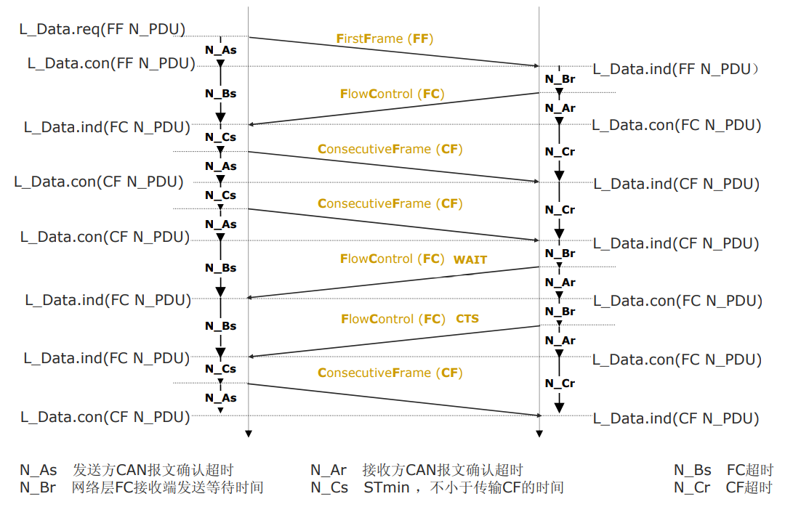
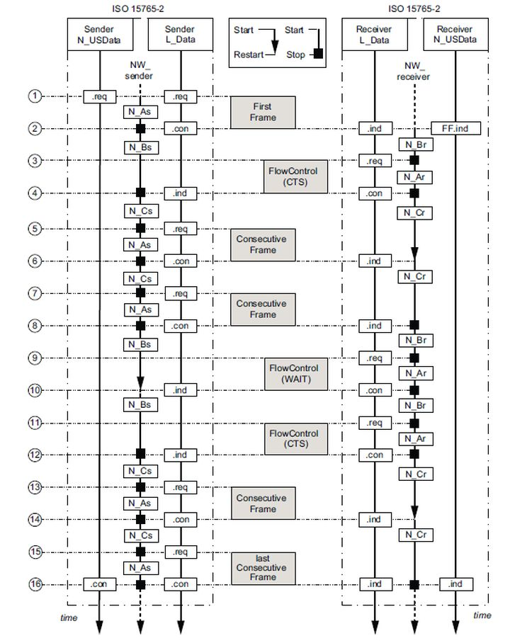

# iso15765

## 基本介绍

本系列标准是 **“UDS语言在CAN网络上的传输规则”**。它解决了如何在带宽有限、报文长度固定的CAN总线上，可靠地传输长度可变的、复杂的诊断报文。

### **ISO 15765-1: 一般信息**
*   **核心定位：本系列标准的“总纲”。**
*   **主要内容：** 介绍了系列的范围、架构以及与OSI模型的对应关系。说明了CAN诊断通信的分层结构。

### **ISO 15765-2: 网络层服务**
*   **核心定位：基于CAN的诊断“长报文传输与路由规则”。**
*   **主要内容：**
    1.  **协议数据单元：** 定义了用于传输诊断信息的**N_PDU结构**。
    2.  **分段与重组：** 详细规定了当诊断数据超出CAN单帧（8字节）时，如何进行**多帧传输（首帧、连续帧、流控帧）** 的协议。
    3.  **时序与错误处理：** 规定了**时间参数、流控机制**以及**传输失败后的恢复策略**。
*   **阅读建议：** **CAN诊断通信开发的核心技术文件。** 它解决了“如何用CAN的短报文安全地传递UDS的长信息”这一关键问题。是ISO 14229-3的基础。

### **ISO 15765-3: 基于CAN的统一诊断服务实现**
*   **核心定位：应用层实现指南（已被取代）。**
*   **主要内容：** 早期版本中定义了基于CAN的UDS实现，其功能已被 **ISO 14229-3** 更完整、更专业地涵盖。此部分目前主要起索引和过渡作用。

### **ISO 15765-4: 排放相关系统的要求**
*   **核心定位：连接CAN诊断与OBD法规的“需求转换器”。**
*   **主要内容：**
    1.  **法规映射：** 将OBD法规对通信的特定要求，**转化并映射为ISO 15765-2网络层的具体配置参数**。
    2.  **OBD特定配置：** 为满足法规，强制规定了用于排放相关诊断的**网络层地址、定时参数、功能寻址行为**等。
*   **阅读建议：** **确保OBD系统在CAN网络上合规的工程配置文件。** 它回答了“为了满足法规，CAN诊断的定时和地址该怎么设”。

---

## 网络层相关

### 多包传输相关

### 时间参数相关

[UDS之时间参数总结篇](https://zhuanlan.zhihu.com/p/368091567)

### **1、应用层时间参数**

**P2 Client：**诊断工具成功发送诊断报文请求之后，等待ECU回复诊断响应的时间间隔。

**P2\* Client：**诊断工具接收到 NRC 0x78 之后继续等待 ECU 响应的时间间隔。

**P2Server_max ：**ECU 在收到请求和给出响应之间的这个时间间隔，它描述了ECU 的反应速度，通常最大值为50ms。

**P2\* Server_max：**ECU 发送 NRC 0x78 之后继续发送 下帧诊断响应报文的时间间隔。

**P3 Client Phys：**诊断工具成功发送 物理寻址诊断请求之后，且无需ECU 回复继续发送下次物理寻址诊断请求的最小时间间隔。

**P3 Client Func：**诊断工具成功发送功能寻址之后再次发送功能寻址的最小时间间隔。

### **2、会话层时间参数**

**S3 Client：**诊断工具为了保持非默认会话模式而发送 $3E 服务请求报文的时间间隔，最小值2000ms。

**S3 Server：**有时也称为S3Timeout，表示ECU未接收到任意诊断报文时维持在非默认会话下的时间间隔。

### **3、传输层时间参数**

**BS：**Block Size，该参数与STmin一般同时出现。这两个参数主要用于诊断报文传输多帧（首帧FF，流控帧FC，连续帧CF）时会使用到。

表示接收方在发送流控帧之后，发送方被允许连续发送的最大流控帧数目。特殊情况下，如果该值为0，则表示发送连续帧没有限制，如果值为5，表示发送方最多能连续发送5帧CF就会继续收到接收方的流控帧。

**STmin ：**在接收方发送流控帧之后，发送方发送的连续帧之间的最小时间间隔。如果值为0，表示对于发送方发送CF的最小时间没有要求。

发送报文的长度过长时，一帧发不完，就会用到多帧，BS与Stmin的大小可用来评估接收方的接收能力，如果都为0，表示接收方接收能力最强。

### **4、网络层时间参数** 

**N_As：**发送方 任意帧类型 从请求发送到发送完成 (接收到对应的ACK) 的时间间隔。

**N_Ar：**接收方 任意帧类型 从请求发送到发送完成 (接收到对应的ACK) 的时间间隔。

**N_Bs：**发送方收到流控帧 的时间。分为3种情况，分别为：

- 发送端 从 发送完首帧（FF）到 收到流控帧（FC） 的时间。
- 发送端 从 发送完连续帧（CF）到 收到流控帧 （FC）的时间。
- 发送端从收到流控帧（FC）（状态为Wait）到 收到下一个流控帧（FC） 的时间。

**N_Br：**接收方请求发送流控帧 的时间。分为3种情况，分别为：

- 接收端从收到首帧（FF）到 请求发送流控帧 （FC）的时间。
- 接收端从收到连续帧（CF）到 请求发送流控帧（FC） 的时间。
- 接收端从 发送完流控帧（FC）(状态为Wait) 到 请求发送下一个流控帧 （FC）的时间。

**N_Cs：**发送方请求发送连续帧（CF） 的时间。分为2种情况：

- 发送端从收到流控帧（FC）到 请求发送连续帧（CF）的时间。
- 发送端从 发送完连续帧（CF）到 请求发送下一帧连续帧（CF） 的时间。

**N_Cr：**接收方收到下一个连续帧（CF） 的时间。分为2种情况：

- 接收端 从 发送完流控帧（FC）到 收到连续帧（CF） 的时间。
- 接收端从 收到连续帧（CF）到 收到下一帧连续帧（CF） 的时间。

## 其他资料

